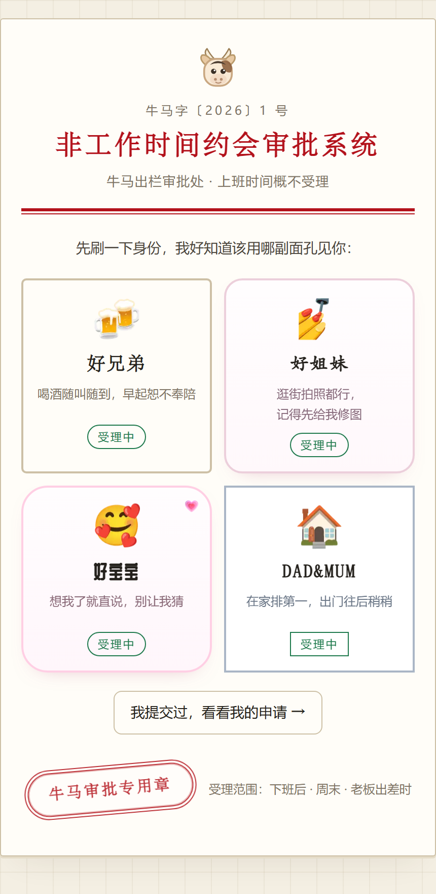
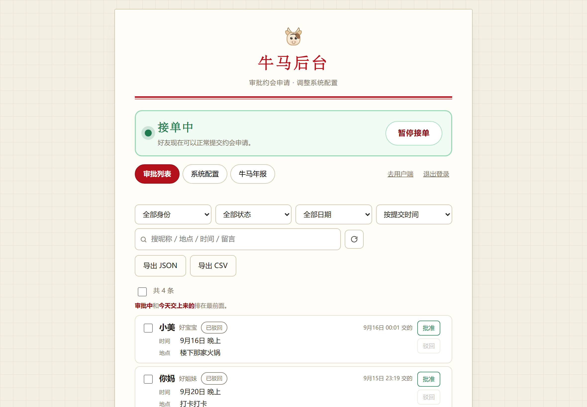

# 非工作时间约会审批系统

一个发给好友的约会时间选择页面，外加一个极简审批后台。内部代号「牛马出栏审批单」。

- **用户端**：一个链接打开 → 选身份 → 选日期和时段（工作时段会被「冻住」）→ 填地点和留言 → 提交
- **后台**：口令登录 → 审批列表 / 改状态 / 备注 / 删除 / 导出，以及改系统配置（改完立即生效，不用发版）
- **不需要登录**：好友端不登录，用浏览器 localStorage 里的随机设备号记住自己的申请

需求口径与已拍板的决定见 `docs/REQUIREMENTS.md`，功能实现状态见 `docs/FEATURES.md`。

## 长什么样

| 选身份 | 选时间 |
| --- | --- |
|  |  |
| 四套身份各有各的一套皮：字体、配色、动效都不同 | 底色只说「有没有空」，休息日和今天用小标记 |

| 选时段 | 后台 |
| --- | --- |
|  |  |
| 工作时间段会被「冻住」，选不了 | 审批列表支持按约会日期排序、按日期窗口筛选 |

> 上表第二张是「好宝宝」那套皮。另外三套（好兄弟 / 好姐妹 / DAD&MUM）风格完全不同。

## 技术栈

| 层 | 选型 |
| --- | --- |
| 前端 | React 19 + Vite 8 + TypeScript，手写 CSS（公文 / 红头文件风 + 卡通表情包风） |
| 后端 | Fastify 5 + TypeScript |
| 数据库 | SQLite，用 Node 内置的 `node:sqlite`（不需要编译原生模块） |
| 配置 | 服务器上的 `config.json`，运行时读取，后台改完立即生效 |
| 部署形态 | 一套代码一套产物；生产环境由后端直接托管前端构建产物 |

## 目录结构

`@
apps/
  server/            Fastify API + SQLite + 静态托管
    src/
      index.ts       进程入口
      server.ts      组装 Fastify（不 listen，方便测试 inject）
      config.ts      环境变量
      settings.ts    config.json 的读写
      submissions.ts 提交记录的增删改查
      auth.ts        后台口令 token（HMAC 签名）
      db.ts          SQLite 建表
      routes/        public / admin / health
      static.ts      生产环境托管前端 + SPA 回退
    data/            运行期数据（SQLite + config.json，已 gitignore）
  web/               React 用户端 + 后台
    src/
      pages/         Entry / Booking / Admin
      components.tsx 公章、小人、时段网格、会躲的按钮
      api.ts         接口封装
      lib.ts         设备号、草稿、文案工具
      styles.css     全部样式
packages/
  shared/            前后端共享：类型、默认配置、时段锁定算法
scripts/
  smoke.mjs          接口冒烟测试
docs/
  REQUIREMENTS.md    需求决策记录
  FEATURES.md        功能清单
  DEPLOY.md          部署到云服务器
`@

## 环境要求

- Node.js >= 20.19（开发机用 24.21 验证）
- pnpm >= 10（开发机用 12.4.1 验证）

## 快速开始

`@bash
pnpm install
pnpm dev
`@

- 前端 http://localhost:5173 （Vite dev server，`/api` 自动代理到后端）
  - `/` 入口页选身份 → `/date/:role` 填写 → `/status/:role` 回执 / 驳回结果
- 后端 http://127.0.0.1:8787
- 后台 http://localhost:5173/admin

> **后台口令从哪来。** 没有默认口令（仓库是公开的，写死的默认值等于公开）。
> 第一次启动时服务会**随机生成一个、存进 `apps/server/data/admin-password`、
> 并在终端打印一次**，抄下来即可。想自己定就往 `apps/server/.env` 里写
> `ADMIN_PASSWORD=...`。详见 [docs/DEPLOY.md 的「管理员鉴权」](docs/DEPLOY.md)。

> Vite 默认只监听 localhost（IPv6）。想用手机在同一个 WiFi 下测试，加 `--host`：
> `pnpm --filter @niumadate/web run dev -- --host`，然后用电脑的局域网 IP 访问。

## 常用脚本

| 命令 | 作用 |
| --- | --- |
| `pnpm dev` | 并行启动前后端开发服务 |
| `pnpm build` | 按依赖顺序构建全部包 |
| `pnpm typecheck` | 全量类型检查 |
| `pnpm start` | 运行已构建的后端（会自动托管 apps/web/dist） |
| `pnpm smoke` | 接口冒烟测试，需要后端正在运行 |
| `pnpm smoke:ui` | 无头浏览器走一遍用户端向导并逐步截图 |

---

## 调试与测试

### 1. 接口冒烟测试（最快）

不需要任何测试框架，直接打真实接口，覆盖 28 项断言：提交校验、时段锁定越权、后台鉴权、配置改动实时生效等。

`@bash
# 终端 A
pnpm --filter @niumadate/server run dev

# 终端 B
pnpm smoke
`@

换地址或口令：

`@powershell
$env:SMOKE_BASE="http://127.0.0.1:8787"; $env:ADMIN_PASSWORD="你的口令"; pnpm smoke
`@

每项输出 ✓ / ✗，最后给失败明细；失败时进程退出码为 1，方便以后接 CI。

### 2. 手动跑一遍完整流程

1. 打开 http://localhost:5173 ，点「好兄弟」
2. 第 1 页填昵称 → 下一步
3. 第 2 页**月历**：用「年 / 月」两个下拉栏直接跳，也可以用两侧 ‹ › 逐月翻；点一天 → 自动翻到第 3 页
4. 第 3 页点「早上」—— 它应该是灰的、选不上，但会弹起床气弹窗
5. 如果这天是工作日，点「中午」—— 应该弹「冻住了」的悬浮提示；
   **点别处、等 3 秒、或者再点一下同一个格子，提示都应该消失**
6. 点「晚上」选中，**再点一下应该能取消**，然后再点回来
7. 点「这几个都不合适？自己定一个时间」—— 进去只填「几点」和「干嘛」，下一步
8. 地点页点「你定吧」—— 按钮会**慢慢往旁边挪一小步就停**；3 秒内再点，它就再挪一步；
   停手 3 秒它会自己挪回原位；回到原位之后再点一次才算认输
9. 下一页是**见面要求**（好友自己写），填一句「带一朵鲜花」，再下一步才是留言
9. 留言页随便写点 → 下一步 → 确认页 → 提交
10. 页面变成「牛马正在骑马赶来的路上……」，**没有**「再填一份」按钮
11. **刷新页面** —— 还是这张回执（设备号记在 localStorage）
12. 打开 http://localhost:5173/admin ，用 `niuma-dev` 登录：列表每条都直接写着
    人物 / 时间 / 地点 / 留言；**点一条，详情就在那条底下展开**（不是跑到最下面）
13. 在详情里写「审批意见」，点「批准」
14. 回用户端刷新 —— 回执文案变成已批准，能看到审批意见，以及**好友自己填的见面要求**
15. 回后台点「驳回」→ 回用户端刷新 —— 进入**驳回单独一屏**，能看到牛马回复；
    点「重新填一份」回入口页，**再选同一个身份应该进填写页，而不是又弹回驳回页**
16. 后台点列表上方的全选框，或勾几条 → 顶部出现「批量批准 / 批量驳回 / 批量删除」

### 3. 无头浏览器走一遍向导（UI 冒烟）

它会启动无头 Chrome，用 CDP 真的去点按钮、填输入框，逐页截图到 `.shots/`，最后核对回执文案。

```bash
pnpm build                                   # 前端产物要交给后端托管
pnpm --filter @niumadate/server run start    # 终端 A
pnpm smoke:ui                                # 终端 B
```

输出长这样：

```
[1] 昵称  screenshot .shots/ui-01-name.png
[2] 日期  screenshot .shots/ui-02-date.png
...
回执文案： 牛马正在骑马赶来的路上……
全部走通 ✅
```

截图目录用 `SHOT_DIR` 改，Chrome 路径用 `CHROME_PATH` 改。

### 4. 用无头浏览器检查界面

改完样式想知道有没有布局塌掉，可以截图出来自己看。系统里的 Chrome 就够：

`@powershell
$chrome = "C:\Program Files\Google\Chrome\Application\chrome.exe"
$ud = Join-Path $env:TEMP "niuma-chrome"

& $chrome --headless=new --disable-gpu --no-first-run `
  --user-data-dir="$ud" --hide-scrollbars `
  --window-size=430,1500 --virtual-time-budget=6000 `
  --screenshot="shots\booking.png" "http://127.0.0.1:8787/date/brother"
`@

（上面两处行尾的 ` 是续行符，实际写的时候换成反引号。）

**顺便教一个查横向溢出的办法**（窄屏最常见的问题）：做一个同源页面，用 iframe 装住目标页，把超出宽度的元素列出来，然后截图看结果。

`@html
<!doctype html><meta charset="utf-8">
<iframe id="f" src="/date/brother" style="width:430px;height:600px;border:0"></iframe>
<pre id="out">pending</pre>
<script>
  document.getElementById("f").addEventListener("load", () => {
    setTimeout(() => {
      const d = document.getElementById("f").contentDocument;
      const vw = 430;
      const wide = [...d.querySelectorAll("*")]
        .map((el) => ({ el, r: el.getBoundingClientRect() }))
        .filter((x) => x.r.right > vw + 0.5 || x.r.left < -0.5)
        .map((x) => x.el.tagName + "." + x.el.className + " R" + Math.round(x.r.right));
      document.getElementById("out").textContent =
        "scroll=" + d.documentElement.scrollWidth + "\n" + (wide.join("\n") || "NO OVERFLOW");
    }, 1500);
  });
</script>
`@

把它丢进 `apps/web/dist/` 再用上面的命令打开，就能看到到底是哪个元素把页面撑宽了。

### 5. 直接看数据

`@powershell
# 数据目录（备份时整个 data/ 一起拷，尤其别漏了 app.db-wal）
Get-ChildItem apps/server/data

# 当前生效的配置（后台改的就是这个文件）
Get-Content apps/server/data/config.json -Raw

# 把记录倒出来
node -e "const {DatabaseSync}=require('node:sqlite');const db=new DatabaseSync('apps/server/data/app.db');console.table(db.prepare('select name,role,status,created_at from submissions order by created_at desc').all())"
`@

### 6. 常见问题

| 现象 | 原因 |
| --- | --- |
| 页面报「配置加载失败」 | 后端没起，或端口被占。看 `pnpm dev` 里 server 的输出 |
| `/api/xxx` 返回了 HTML | 不应该。`/api` 下的未知路径必须是 404 JSON，检查 `static.ts` 的回退判断 |
| `Cannot find package 'sqlite'` | `node:sqlite` 的 `node:` 前缀被 esbuild 吃掉了。`db.ts` 里改成运行时 createRequire 就是为了绕开它 |
| 后台登录一直失败 | 口令不对，或者改了 `SESSION_SECRET` 导致旧 token 失效（重新登录即可） |
| 文案 / 开关改了前端没变 | 配置是每次请求读盘的，硬刷新浏览器（Ctrl+F5） |
| 中午看不到冷热小人 | 判定按所选日期的月份，默认只有 6-8 月算热、12/1/2 月算冷。后台「中午冷热」把月份改宽即可 |

---

## 配置

全部配置在服务器上的 `apps/server/data/config.json`，由后台「系统配置」页写入；也可以手改，不用重启（下次请求就会读到）。

后台可改的部分：

| 分类 | 内容 |
| --- | --- |
| 身份卡片 | 四张卡的开 / 关、名字、表情、一句话、关闭时甩的话 |
| 工作制 | 当前生效的是 996 / 865 / 自定义；每周哪几天上班、几点到几点；锁定规则 |
| 时段 | 早 / 中 / 晚 的边界时间 |
| 规则开关 | 可选天数、是否允许自定义时间、是否允许多选 |
| 地点玩法 | 是否允许「让你定」、按钮文案、躲闪后文案、接受后文案 |
| 文案 | 早上弹窗、中午冷热、锁定提示、提交成功、关停标题 |
| 数值 | 可选天数（默认 60）、约会日后第几天允许重填（默认 1，即第二天） |

### 关于「时段被冻住」

默认 `lockMode: "covered"` —— 一个时段**完全落在**工作时间内才锁。以 996（周一至周六 09:00–21:00）为例：

| 时段 | 边界 | 工作日 |
| --- | --- | --- |
| 早上 | 06:00–11:00 | 可用（没被完全包住） |
| 中午 | 11:00–17:00 | 冻住 |
| 晚上 | 17:00–23:00 | 可用 |

这样「有些时间被锁」成立，早 / 晚的梗也能跑起来，同时还有「自己加一条时间」兜底。想更狠就切 `overlap`（只要有交集就锁）。

## 环境变量

见 `.env.example`，复制成 `apps/server/.env`：

| 变量 | 默认值 | 说明 |
| --- | --- | --- |
| `HOST` | `127.0.0.1` | 监听地址，上线要改成 `0.0.0.0` |
| `PORT` | `8787` | 监听端口 |
| `WEB_ORIGIN` | `http://localhost:5173` | CORS 允许的前端来源 |
| `LOG_LEVEL` | `info` | Fastify 日志级别 |
| `LOG_FILE_MAX_MB` | `5` | 日志文件上限，超了滚成 `.1`（只留一代） |
| `SUBMIT_RATE_MAX` | `120` | 提交限流：窗口内最多次数 |
| `SUBMIT_RATE_WINDOW_MIN` | `60` | 提交限流的窗口（分钟） |
| `LOGIN_RATE_MAX` | `40` | 后台登录限流：窗口内最多次数 |
| `LOGIN_RATE_WINDOW_MIN` | `10` | 后台登录限流的窗口（分钟） |
| `ADMIN_PASSWORD` | **随机生成** | 后台口令。不设就生成一个存进 `data/admin-password` 并打印一次 |
| `SESSION_SECRET` | **随机生成** | token 签名密钥。换掉它 = 所有已登录的会话全部失效 |
| `DATA_DIR` | `apps/server/data` | 数据目录（口令文件也存在这里） |
| `WEB_DIST` | `apps/web/dist` | 前端产物目录 |

**这两项为什么没有默认值。** 仓库是公开的，任何写死的默认口令都等于公开；
会话密钥更严重 —— 知道它的人可以**自己签一个合法 token**，连口令都不用猜。
所以「没配」的后果只能是随机生成，不能是兜底。

## 日志

后端打结构化 JSON 日志，默认进标准输出；设了 `LOG_FILE` 就同时追加到文件。

### 会记什么

| 事件 | 级别 | 关键字段 |
| --- | --- | --- |
| 启动横幅 | info | url / dataDir / webDist / logFile / usingDevSecrets |
| 没找到前端产物 | warn | webDist |
| 每次请求 | info | method / url / statusCode / responseTime |
| 收到申请 | info | id / role / name / deviceId / 时段数 / 地点 |
| 提交被拒 | warn | code / ip / 完整提交内容 |
| 后台登录成功 / 失败 | info / warn | ip |
| 后台未授权访问 | warn | ip / url |
| **配置变更** | info | **ip + 逐字段 diff** |
| 审批状态变更 | info | id / name / 改了什么 |
| 删除申请 | warn | id / name / role |
| config.json 解析失败 | error | 文件路径 + 原因（文件不会被覆盖） |

配置变更那一行长这样，出问题时一眼就能看出是谁把哪个字段改成了什么：

```json
{"level":30,"ip":"127.0.0.1","count":1,
 "changes":["dateRangeDays: 14 → 60"],
 "msg":"后台更新了配置（1 处变更）"}
```

### 怎么看

```bash
# 开发：直接看终端

# 生产（systemd）
journalctl -u niumadate -f

# 只看配置变更
journalctl -u niumadate | grep '更新了配置'

# 落到文件：.env 里设 LOG_FILE=/var/log/niumadate/app.log，然后
tail -f /var/log/niumadate/app.log
```

### 前端

浏览器控制台里，请求失败会打 `[api] GET /config → HTTP 500 BAD_CONFIG` 这样的行，方便分辨是接口挂了还是页面逻辑问题。

## 部署

见 `docs/DEPLOY.md`（从零到能发给好友的链接，十步）。

### 想先试一把、又不想弄脏本机

有两条路，**都能删得一干二净**。

**一、Docker（最干净，推荐）**

> ⚠️ **在国内拉不动镜像。** Docker Hub 直连超时，免费公共加速器也基本都停了
> （实测：hello-world 能拉，80MB 的 node:24-slim 就断）。
> **先让 Docker 走代理**，否则第一步就卡住：
>
> Docker Desktop → Settings → Resources → Proxies → Manual proxy configuration
> → HTTP / HTTPS 都填 `http://127.0.0.1:7897`（Clash Verge 默认端口，以你实际的为准）
> → Apply & Restart
>
> **不能只开 Windows 的「系统代理」** —— Docker 引擎跑在 WSL2 虚拟机里，吃不到它。
> 验证：`docker pull node:24-slim` 能下来就成了。
>
> （香港 / 境外的服务器不需要这一步，那边 Docker Hub 是直通的。）

```bash
docker compose up -d            # 第一次会自动构建，实测 42 秒
docker compose logs -f app      # 后台口令在里面，第一次启动时打印一次

# 打开 http://localhost:8788
```

不要了：

```bash
docker compose down -v          # -v 会把数据卷一起删掉，一点都不剩
docker image rm niumadate       # 镜像也一起清掉（可选）
```

数据放在名为 `niumadate-data` 的卷里 —— 容器删了它还在，`down -v` 才真删。

**二、不装 Docker（脚本，用同样的代码 + 独立目录）**

```bash
pnpm -r run build
node scripts/sandbox.mjs start      # 起在 8788，数据在 .sandbox/

node scripts/sandbox.mjs status     # 看状态、看口令
node scripts/sandbox.mjs stop       # 停掉，数据留着
node scripts/sandbox.mjs nuke       # 删掉 .sandbox/，彻底没了
```

它不复制代码，只是**换了个数据目录和端口**，所以和 8787 那份主环境完全互不干扰。

## 还没做

- 自动化测试（Vitest + Fastify `inject`；目前只有冒烟脚本）
- ESLint + Prettier
- CI
- 后台的「已读 / 未读」标记
